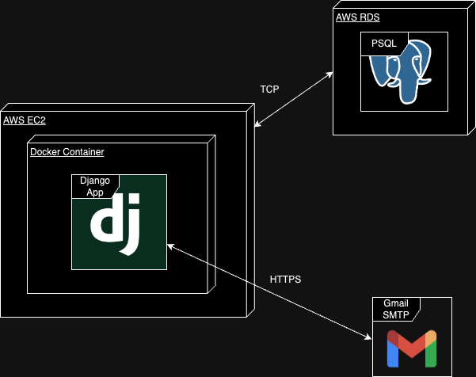

# Software Requirements Specifications

## Objective
Design and implement a robust and scalable catalog management system with a RESTful API that enables efficient product management, secure user access control, and real-time notifications for product updates, while also tracking product views for future analytics.

## Scope

This project encompasses the following features and functionalities for a catalog management system:

**1. Product Management**

*   **Product Information:** The system will manage the following product attributes:
    *   SKU (Stock Keeping Unit) - Unique identifier for each product
    *   Name - Descriptive name of the product
    *   Price - Current price of the product
    *   Brand - Brand associated with the product
    *   Number of Views - Counter to track product views by anonymous users
*   **Product Operations:**
    *   **Create:** Add new products to the catalog.
    *   **Read:** Retrieve product information (including individual product details and lists of products).
    *   **Update:** Modify existing product information.
    *   **Delete:** Remove products from the catalog.

**2. User Management and Authentication**

*   **User Roles:**
    *   **Administrator:** Possesses full privileges, including:
        *   All product operations (create, read, update, delete).
        *   Management of administrator accounts (create, read, update, delete).
    *   **Anonymous User:** Can only:
        *   Retrieve product information (read-only access).
*   **Authentication:**
    *   Secure authentication mechanisms for administrators.
  
**3. Notification System**

*   **Real-time Notifications:**
    *   The system will send real-time notifications to all administrators when another administrator makes changes to a product.
    *   Notification delivery mechanism (e.g., email, in-app notifications) will be determined during implementation.

**4. Product View Tracking**

*   **View Counting:**
    *   The system will track the number of times each product is viewed by anonymous users.
    *   This data will be used for future reporting and analytics purposes.

**5. API**

*   **RESTful API:**
    *   The system will be a RESTful API to facilitate interaction and data exchange with clients.

## Functional Requirements
### Product management
- **User Story 1:** As an administrator, I want to be able to create new products so that I can add them to the catalog.
  - **Acceptance Criteria:**
    - The system should allow me to input all the necessary product information (name, price, brand)
    - The system should validate the input to ensure that all required fields are filled and that de data is in correct format.
    - The system should generate a unique identifier (SKU) for each product if one is not provided.
    - The system should store the new product information in the database.
    - The system should return a success message and the newly created product information upon successful creation.
- **User Story 2:** As an administrator I want to be able to view a list of all products so that I can have an overview of the catalog.
  - **Acceptance Criteria:**
    - The system should return a list of all products in the catalog.
    - The list should include the SKU, name, price, and brand of each product.
    - The list should be paginated to handle a large number of products.
- **User Story 3:** As an administrator, I want to be able to view the details of a specific product so that I can access all the information about it.
  - **Acceptance Criteria:**
    - The system should allow me to access the product details page by providing the product's SKU or ID.
    - The system should display all the information about the product, including SKU, name, price, brand, and the number of views.
- **User Story 4:** As an administrator, I want to be able to update the information of a product so that I can keep the catalog up-to-date
  - **Acceptance Criteria:**
    - The system should allow me to modify any of the product information (SKU, name, price, brand).
    - The system should validate the input to ensure that all required fields are filled and that the data is in the correct format.
    - The system should update the product information in the database.
    - The system should return a success message and the updated product information upon successful update.
    - The system should send a notification (via email) to all other administrators about the product change.
- **User Story 5:** As an administrator, I want to be able to delete a product from the catalog so that I can remove outdated or irrelevant items.
  - **Acceptance Criteria:**
    - The system should allow me to delete a product by providing the product's SKU.
    - The system should remove the product information from the database.
    - The system should return a success message upon successful deletion.
- **User Story 6:** As an anonymous user, I want to be able to view a list of all products so that I can browse the catalog.
  - **Acceptance Criteria:**
    - The system should return a list of all products in the catalog.
    - The list should include the SKU, name, price, and brand of each product.
    - The list should be paginated to handle a large number of products.
- **User Story 7:** As an anonymous user, I want to be able to view the details of a specific product so that I can access all the information about it.
  - **Acceptance Criteria:**
    - The system should display all the information about the product, including SKU, name, price, and brand.
    - The system should increment the product's "number of views" counter.

### User Management
- **User Story 8:** As an administrator, I want to be able to create new administrator accounts so that I can grant access to other users.
  - **Acceptance Criteria:**
    - The system should allow me to input the necessary information for the new administrator account (username, password, email).
    - The system should validate the input to ensure that all required fields are filled and that the data is in the correct format.
    - The system should store the new administrator account information securely in the database.
    - The system should display a success message and the newly created account information upon successful creation.
- **User Story 9:** As an administrator, I want to be able to view a list of all administrator accounts so that I can manage them effectively.
  - **Acceptance Criteria:**
    - The system should return a list of all administrator accounts.
    - The list should include the username and email of each administrator.
- **User Story 10:** As an administrator, I want to be able to update the information of an administrator account so that I can keep the account information up-to-date.
  - **Acceptance Criteria:**
    - The system should allow me to modify any of the account information (username, password, email).
    - The system should validate the input to ensure that all required fields are filled and that the data is in the correct format.
    - The system should update the administrator account information in the database.
    - The system should return a success message and the updated account information upon successful update.
- **User Story 11:** As an administrator, I want to be able to delete an administrator account so that I can remove access for specific users.
  - **Acceptance Criteria:**
    - The system should allow me to delete an administrator account by providing the account's username or ID.
    - The system should remove the administrator account information from the database.
    - The system should return a success message upon successful deletion.

### Notification system
- **User Story 12:** As an administrator, I want to be notified in real-time when another administrator makes a change to a product so that I can stay informed about the catalog updates.
  - **Acceptance Criteria:**
    - The system should send a notification to all other administrators whenever a product is created, updated, or deleted.
    - The notification should include relevant information about the product change (e.g., product name, changed fields, old values, new values).
    - The notification should be delivered in real-time using a suitable mechanism (e.g., email, in-app notifications).

### Product View Tracking

- **User Story 13:** As an administrator, I want the system to track the number of times each product is viewed by anonymous users so that I can gather data for future reporting and analytics.
  - **Acceptance Criteria:**
    - The system should increment the "number of views" counter for a product every time it is viewed by an anonymous user.
    - The system should store the "number of views" counter in the database.
    - The system should make this data accessible for reporting purposes.

## Architecture

### 1. Django Application (within Docker Container)

*   **Technology Choice:** Django is a robust and mature Python web framework well-suited for building RESTful APIs. Its built-in features for handling HTTP requests, data modeling, and user management align perfectly with the project's needs.
*   **Containerization (Docker):** Containerizing the Django application with Docker offers several advantages:
    *   **Consistency:** Ensures the application runs the same way across different environments (development, testing, production).
    *   **Portability:**  Makes it easy to deploy the application on various platforms and cloud providers.
    *   **Isolation:** Isolates the application and its dependencies from the host system, preventing conflicts and improving security.
    *   **Efficiency:** Docker images are typically lightweight and efficient, optimizing resource utilization.
*   **API Framework:** Django REST framework (DRF) will be used to build the API. DRF simplifies API development by providing features like serialization, authentication, and API documentation.

### 2. PostgreSQL Database (AWS RDS)

*   **Data Persistence:** PostgreSQL is a powerful and reliable open-source relational database. It's well-suited for storing structured data like product information, user details, and view counts.
*   **Scalability and Availability:** Hosting the database on AWS RDS (Relational Database Service) provides scalability and high availability. RDS handles database management tasks, including backups, software patching, and scaling, allowing you to focus on application development.

### 3. AWS Elastic Beanstalk

*   **Cloud Deployment:** AWS Elastic Beanstalk is a Platform-as-a-Service (PaaS) offering that simplifies deploying and managing web applications and APIs in the cloud.
*   **Scalability and Load Balancing:** Elastic Beanstalk allows you to easily scale your application by adding or removing instances based on demand. It can also handle load balancing to distribute traffic efficiently across multiple instances.
*   **Integration with AWS Ecosystem:** Elastic Beanstalk seamlessly integrates with other AWS services like RDS, SES, and IAM, making it easy to leverage the broader AWS ecosystem.

### 4. AWS SES (Simple Email Service)

*   **Notification System:** AWS SES is a cost-effective email sending service that enables you to send notifications to administrators about product changes.
*   **Reliability and Scalability:** SES is a highly reliable and scalable service, ensuring that notifications are delivered promptly even with a large number of administrators.

### 5. HTTPS and TCP Protocols

*   **HTTPS:**  Using HTTPS for communication between clients and the Django API ensures secure data transmission and protects sensitive information.
*   **TCP:** TCP (Transmission Control Protocol) is used for reliable communication between the Django application and the PostgreSQL database.

OK, here are the non-functional requirements for your product catalog API, including details about maintainability, scalability, security, portability, and compatibility.

## Non-Functional Requirements

### 1. Maintainability

*   **Code Structure:** The API will be developed using a clear and well-defined structure to ensure maintainability. This includes:
    *   **Modular Design:** The code will be organized into logical modules and components to improve readability and separation of concerns.
    *   **MVT Pattern:** The API will be developed using Django's Model-View-Template (MVT) architectural pattern.
        *   **Models:** Define the structure and behavior of data (e.g., Product model with attributes like SKU, name, price).
        *   **Views:** Handle API requests, interact with models, and select appropriate serializers (e.g., views for product CRUD operations).
        *   **Templates:**  HTML Templates (in this case this wont be used because frontend is out of the scope of this project).
    *   **Meaningful Naming:**  Variables, functions, and classes will have descriptive and meaningful names to enhance code readability.
*   **Code Style and Comments:**
    *   **PEP 8 Compliance:** The code will adhere to the PEP 8 style guide for Python code to ensure consistency and readability.
    *   **Comments:**  Clear and concise comments will be used to explain complex logic, algorithms, and design decisions. Comments will follow PEP 8 standards for placement and formatting.

#### 2. Scalability

*   **Horizontal Scaling:** The API will be designed to scale horizontally by adding more instances of the Django application behind a load balancer. This will allow the API to handle increased traffic and demand.
*   **Database Scaling:** The PostgreSQL database can be scaled vertically by increasing its resources (CPU, memory, storage) or horizontally using techniques like read replicas.
*   **AWS Elastic Beanstalk:** Deploying the API on AWS Elastic Beanstalk facilitates scalability by providing auto-scaling features and load balancing capabilities.

#### 3. Security

*   **Authentication:**
    *   **Django REST Framework Authentication:** The API will use Django REST framework's authentication modules to handle user authentication.

*   **Authorization:**
    *   **Permission Classes:** Django REST framework's permission classes will be used to define fine-grained access control to different API endpoints and resources.
    *   **Role-Based Access Control (RBAC):**  RBAC will be implemented to assign different roles (e.g., administrator, anonymous user) and grant appropriate permissions based on those roles.
*   **Password Security:**
    *   **Password Hashing:** Passwords will be stored securely using strong hashing algorithms (e.g., bcrypt, Argon2) to prevent unauthorized access.
    *   **Salting:**  Salts will be used to further protect passwords from brute-force attacks.
*   **Data Protection:**
    *   **HTTPS:** All API communication will be encrypted using HTTPS to protect data in transit.
    *   **AWS Security Best Practices:** The API and database will be deployed following AWS security best practices, including the use of security groups, IAM roles, and VPCs.

#### 4. Portability

*   **Docker Containerization:** Containerizing the application with Docker enhances portability by allowing it to be deployed on any system that supports Docker.
*   **Cloud-Agnostic Design:** While the initial deployment will be on AWS Elastic Beanstalk, the API will be designed to be relatively cloud-agnostic, making it possible to migrate to other cloud providers if needed.

#### 5. Compatibility

*   **Documentation:** Clear and comprehensive API documentation will be provided to facilitate integration with various clients and applications.

